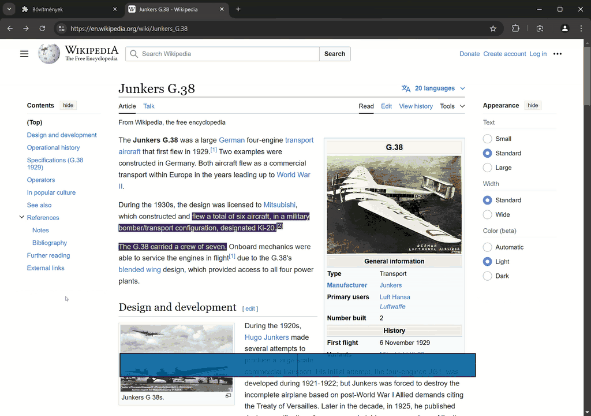

# Typing practice on any website

# Controls

- `<F2>`: Enable/disable overlay
- Once the overlay is open, you can start typing as if you were searching in the webpage (case sensitive).
- `<Tab>`: The search results from the above can be cycled through by pressing tab.
- `<Enter>`: Select the current search candidate
- Continue typing out the text. Typos will be highlighted until the error is corrected (use `<Backspace>`). For characters that you may not be able to type, you can press `.`, which will always be accepted.
- `<Enter>`: Finish typing at the current location. Places you back into search mode.

# TODO

This was a hobby project for me to learn more about browser extensions a few years ago. I updated the README for archival purposes but it is unlikely that I'll ever get back to this long list of TODOs.

- handle iframes and shadow roots when searching
- handle no next element
- colors...
- fix space trimming if necessary
- handle typing near the end of document
- tab while typing autotypes till next space (or next char typed, like `f<search char>` in kakuone)
- flash something when wrong char is entered
- while typing, `ctrl+bs` to delete all wrongchar
- fix leak/infinite loop / improve searching speed
- handle invisible characters/emojis/UTF-8
- change enter key bindings (enter in looking stays, while typing enter means linefeed/new paragraph, escape for going back to looking mode)
- insert newline to type when there is a new paragraph (right now there is no whitespace)

---

- jump between buffers
- allow looking for identical matches inside the same element (hud)
- logs of typed content and statistics in background/options page, current typing speed in HUD

---

- remembering state between reloads

---

- autopilot mode for quick reading with different hud (centered word, bigger, configurable speed)
- text to speech in autopilot mode

---

- webcomponents for HUD, etc.
